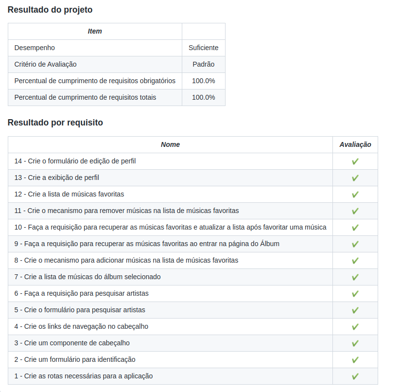

<h1>Sobre</h1>

Terceiro projeto do módulo 2 - Front-end, da <a href="https://betrybe.com" target="_blank">Trybe!</a>

Nesse projeto aprendemos o conceito de Single Page Application - SPA.
 

A proposta foi criar uma aplicação em que era possível buscar pelos álbuns de interesse, adicionar as músicas em uma lista de favoritos, bem como visualizar e editar o seu perfil. Tudo isso criando rotas com o React Router.

obs: Utilizamos uma API do itunes.

<h1>Instalando</h1>

Para instalar, basta executar o comando <code>npm install</code> no diretório raiz do projeto.

Logo depois execute o comando <code>npm start</code>

<h1>Tecnologias utilizadas</h1>

<ul>
  <li>React</li>
  <li>React Router</li>
</ul>

<h1>Nota</h1>
